# Transformer算法原理

## 算法背景

Transformer 由Google的研究团队提出；论文发表于2017年。主要致力于在序列建模中提升并行性与长距离依赖建模能力，摆脱对循环与卷积的依赖。Transformer主要做的工作如下：

**结构**：利用编码器与解码器的结构

**三种注意力**：`编码器多头自注意力`、`交叉注意力`、`解码器多头自注意力（含因果掩码）`

**位置信息**：用位置编码赋予词向量序列信息

**残差连接 + 层归一化 + 前馈网络(FFN)**：形成标准层块，稳定深层训练。


影响与演进：

NLP 基石：BERT、大模型系列；

跨模态扩展：ViT（图像）、多模态大模型。


## 整体架构

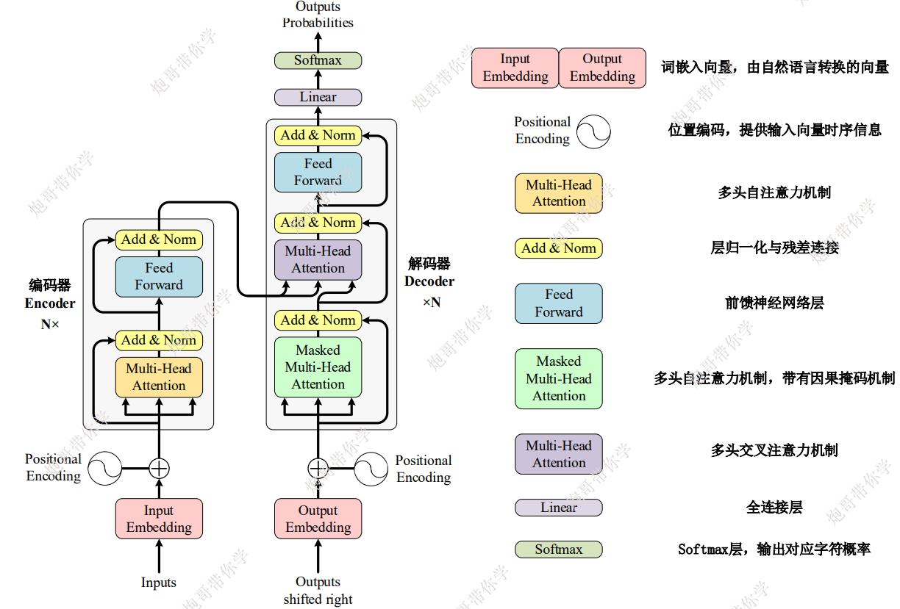


**编码器与解码器的复用**

编码器(Encoder)与解码器(Decoder)后面都有"xN"，这表示这两部分的内容都可以进行复用(nn.Sequential)


**模型大致运行机制举例**

Inputs同时输入三个词`I love you`，此时Outputs shifted right输入一个开始信号设为`"Start"`，Outputs接收到后输出一个`我`

之后Outputs shifted right输入一个`"Start" 我`，Outputs接收到后输出一个`爱`

之后Outputs shifted right输入一个`"Start" 我 爱`，Outputs接收到后输出一个`你`

之后Outputs shifted right输入一个`"Start" 我 爱 你`，Outputs接收到后输出一个结束信号`"End"`

之后Outputs shifted right输入一个`"Start" 我 爱 你 "ENd"`，此时接收到结束信号，模型结束


以上运行机制的**实例证明**就是：当前的大模型也都是一个字一个字地输出的。


**三个注意力机制的出现位置**

1.多头注意力机制

出现在Inputs之后的编码器

2.多头注意力机制（含因果掩码机制）

出现在Outputs shifted right之后的解码器

3.多头交叉注意力机制

出现在Outputs shifted right之后的解码器，但是同时接收编码器与解码器两方的参数


## 独热+词嵌入矩阵处理输入数据

**NLP输入数据的基本格式**

Transformer算法的最基本应用是NLP，NLP中最基本的应用是机器翻译，我们的数据的输入与输出都是文本。

```python
# 训练数据
  输入数据 标签
  英句1  	 汉句1
  英句2  	 汉句2
  英句3  	 汉句3
  英句4  	 汉句4
  英句5  	 汉句5
```


**处理自然语言的基本流程**

1.收集大量文本数据

2.把字符串切成token，具体如下：

我是一条狗 ->[我,是,一条,狗]

3.统计收集的样本中token的出现频次，并进行排序

4.将token转换为独热向量

5.生成一个词嵌入矩阵，词嵌入矩阵与每隔token的独热向量进行矩阵相乘，生成比较小的词向量


**独热向量处理输入数据**

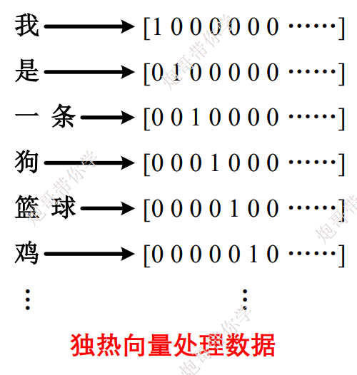

独热向量缺点:独热向量值维度巨大，假设词表大小 𝑉。V=50k 时每个词是 50k 维、只有 1 个非零。


**词嵌入矩阵化简独热向量**

鉴于独热向量的缺点（维度巨大），我们需要想办法化简它。

我们设每个独热向量的行高为v，列宽就是1，此时每个独热向量就是一个`vx1矩阵`

我们再次假设一个词嵌入矩阵，它的行高为d，列宽为v，假设的d最好远远小于v，才能拥有降低维度的效果，此时一个词嵌入矩阵就是一个`dxv矩阵`

我们将**词嵌入矩阵**与**独热向量**矩阵相乘，获得一个被压缩后的矩阵，大小为`dx1`，此时独热向量维度巨大的缺点被克服，我们获得了一个新的特征矩阵，我们称他为`词向量`


补充：词嵌入矩阵是一个权重表，最开始它的值是随机的，经过训练后权重参数会被反向传播逐步优化（类似于卷积核内部参数的优化）


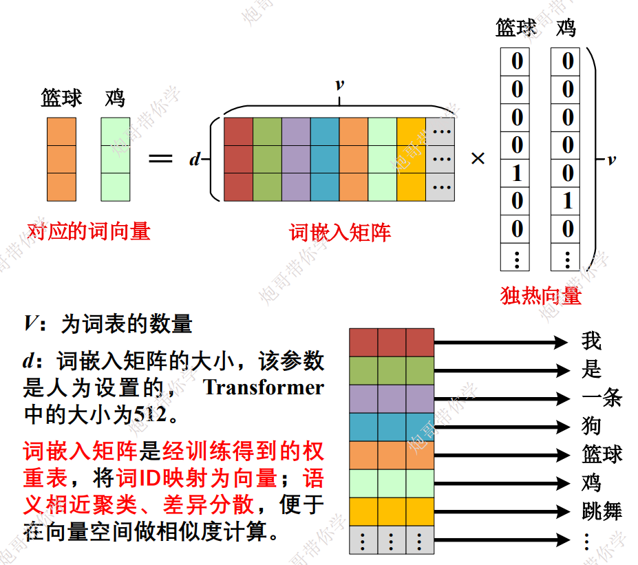


最终，词嵌入矩阵训练好之后，对于一句话中的token他会进行一个非常特征明显的分类，获得的词向量就会更好，类似于下面的效果（假设d=4，就会得到4分类）

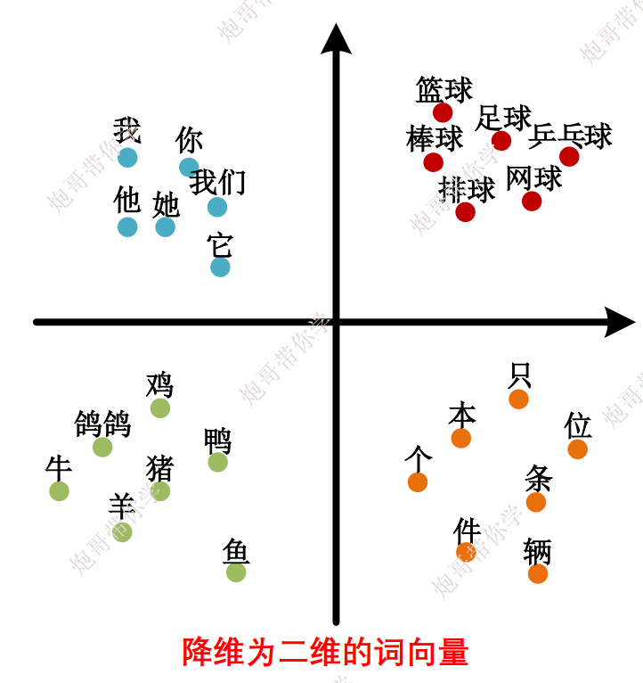


## 位置编码


d表示词嵌入矩阵的行高，i表示在一个词向量中的位置，pos表示当前token在序列中的位置


计算流程如下：

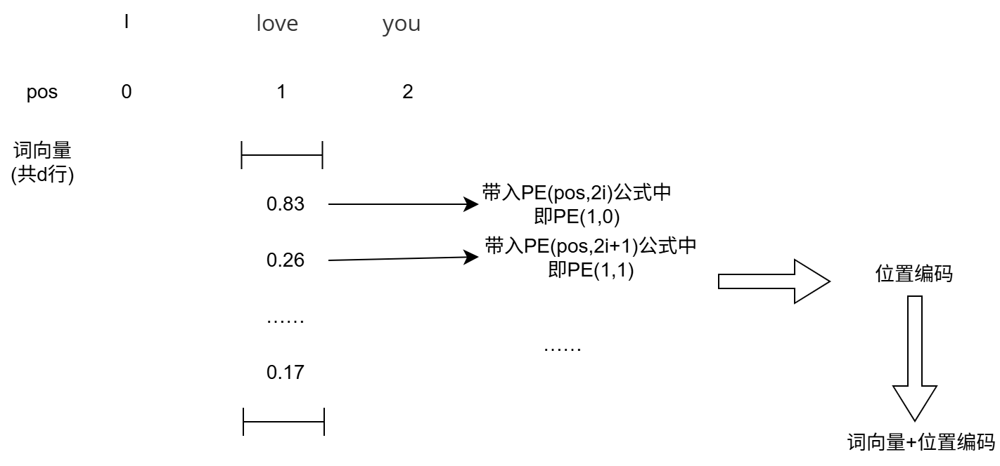


## 自注意力机制

**注意力机制的作用**

1.计算输入数据（各个词向量）的关联程度

2.通过关联程度来提取输入的词向量之间的有用信息

3.输出包含不同注意力分配的信息


**注意力机制相较于RNN的优势**

Transformer中注意力机制的核心作用是**让模型在处理每个词时，能够动态地关注整个输入序列中所有相关的词，并把这些信息融合进来，从而获得更丰富的上下文表示**。

具体来说，它带来两个关键好处：
- **捕捉长距离依赖**：无论两个词在句子中相隔多远，注意力机制都能直接建立联系，解决了RNN难以处理长距离信息的痛点。
- **支持并行计算**：所有位置可以同时计算相互之间的注意力，而不是像RNN那样逐步传递，大大提升了训练效率。

简单说，就是**让每个词都能“看到”整个句子，并自动聚焦对理解当前词最重要的部分**。


**注意力机制的计算**

$W^q$、$W^k$、$W^v$是三个权重矩阵，他们初值均为随机数，之后可以通过反向传播来优化。

我们的输入是词向量矩阵a1、a2、a3、……

我们的输出是带有注意力机制的b1、b2、b3、……


1.q、k、$\alpha$的计算与三者的关系

此处的乘法都是矩阵乘法

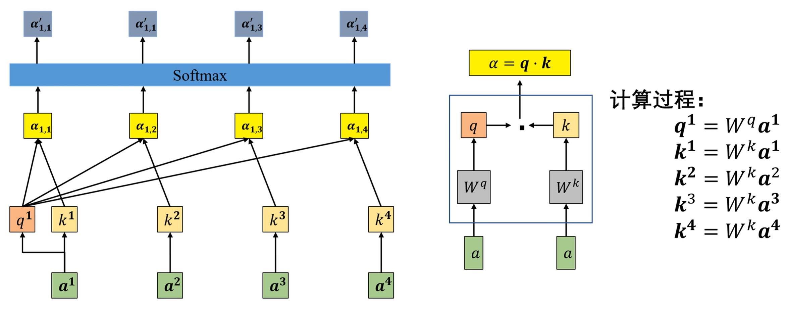


2.$\alpha$、v、b的计算与三者的关系

此处的乘法都是矩阵乘法

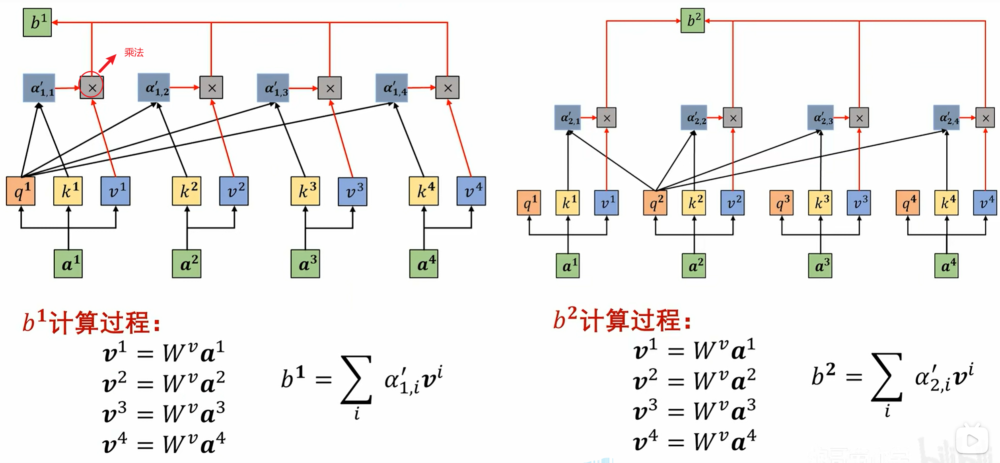


## 自注意力机制（矩阵理解）

右边上面是$\alpha$矩阵、右边下面就是b矩阵

输入$L \times d$的多个词向量拼接起来的矩阵，输出是$L \times d_k$的包含了与其他词的关联的矩阵

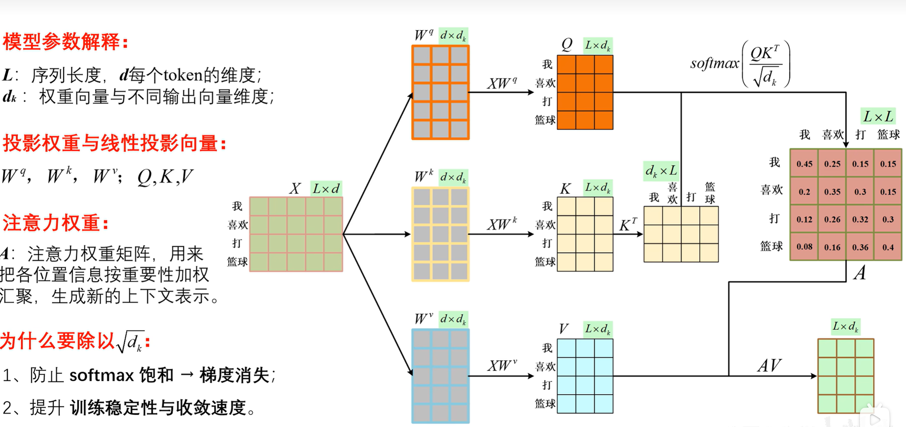


添加上与上一节课中对应的标记


**总体的计算公式:**
$$
A=softmax(\frac{QK^T}{\sqrt{d_k}})
\\注意力机制矩阵=A \cdot V
$$


## 多头注意力机制

**多头注意力机制与注意力机制的区别**

多头注意力机制有多组Q、K、V矩阵，输出多个注意力机制矩阵，之后在$d_k$那个维度上进行拼接，最后将输出结果(一个$L \times 8d_k$大小的矩阵)与$W_O$权重矩阵(一个$8d_k \times d$大小的矩阵)进行一个矩阵乘法


**$W_O$矩阵的作用（多头注意力机制的作用）**

$W_O$矩阵初值随机，可以用反向传播机制来进行优化。引入$W_O$是为了将最后输出的、带有注意力机制的矩阵，转化成原来的$L \times d$大小，方便与最开始词向量构成的矩阵进行一个残差融合（残差运算同ResNet）


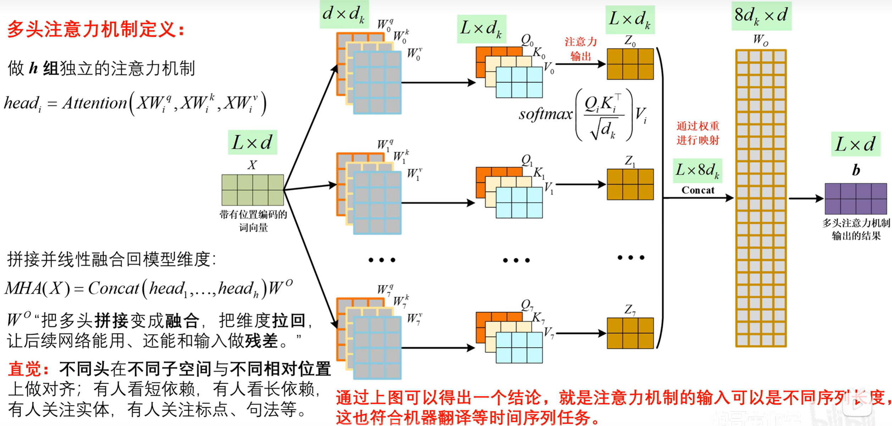

多头注意力机制的直觉理解：多种注意力矩阵，能够注意到更多的方面。有的矩阵注意到短依赖、有的矩阵注意到长依赖、有的矩阵注意到实体、有的矩阵注意到句式等等。总之不同注意力矩阵关注的方面不一样，多一点注意力矩阵，能提取出来的特征更多。


## 掩码注意力机制-填充掩码

填充的原因：

同一批次中，每一句话的token数量一样多，才比较好进行并行计算。

填充的做法：

选择同一批次中含有最多的token的句子，把他的token数量记录下来，我们暂时记为MaxNum，然后把其他句子的**带有位置编码的词向量**构成的矩阵从`Lxd`填充到`MaxNumxd`，填充部分全为0。之后还需要对$\alpha$矩阵的外围填充负无穷，负无穷经过softmax之后就会变成0

具体做法如图

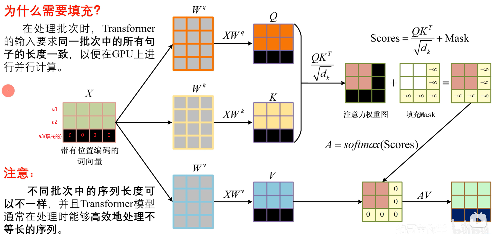

注意：填充是以批次为单位的，同一个批次中，句子长度都会被填充为一致的。


输入：a1、a2、a3(填充的)

输出：b1、b2、b3(填充的)

输入与输出的填充部分的行不变，均为全0。


补充思考：既然输入部分与输出部分的最后填充的几行全为0，为什么还要带着填充部分算完整个注意力流程呢，难道不能直接在注意力矩阵处直接填充吗？

虽然填充部分不变，还是为0，但是这个注意力矩阵求的过程中，也可以让其他位置的token知道，填充行与他们没有关系，所以在最开始需要带着填充算完整个注意力机制流程，不能直接在最后的输出结果上拼接0.


## 层归一化

**批归一化与层归一化的区别**

如下图所示，批归一化是对不同样本同一位置的参数进行标准正态处理，层归一化是对同一样本不同位置的参数进行标准正态处理。

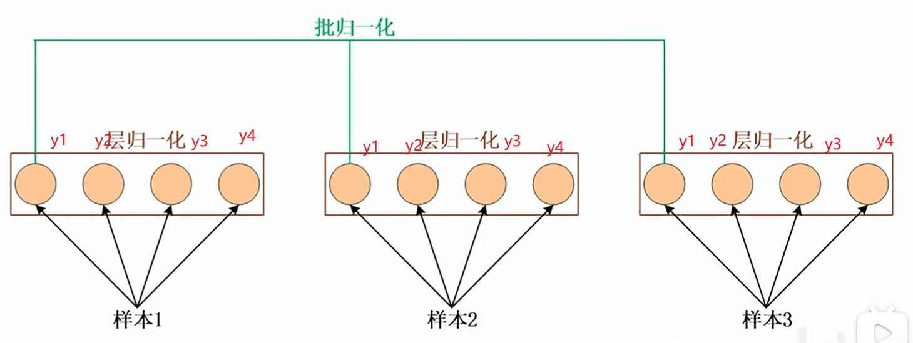


**层归一化具体计算方式**

$\beta$、$\gamma$ 是两个可学习参数，他们初始为随机值，后面被反向传播优化

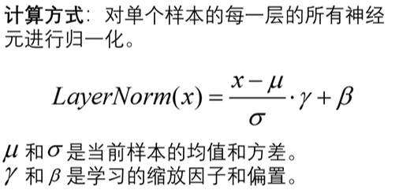


## 前馈神经网络

前馈神经网络是一种无循环的多层神经网络，信息从输入到输出单向流动。"前馈神经网络"是一种结构类型而不是特定网络。

我们之前学习的神经网络，例如：AlexNet、ResNet、甚至说一个普通的全连接神经网络都是前馈神经网络


**Transformer中的前馈神经网络**

是两个全连接层，两个全连接层输入与输出特征数相反，例如：

X先输入进一个 in_features=4、out_features=5的全连接层，获得了Y，之后将Y输入进一个in_features=5,out_features=4的全连接层，获得一个大小同输入的X相等的矩阵。

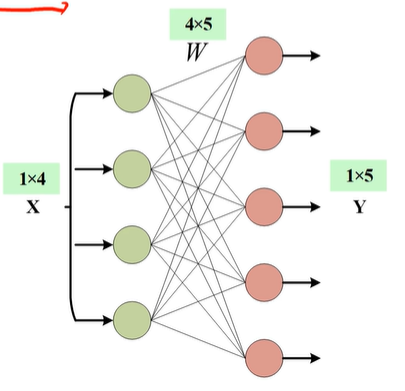

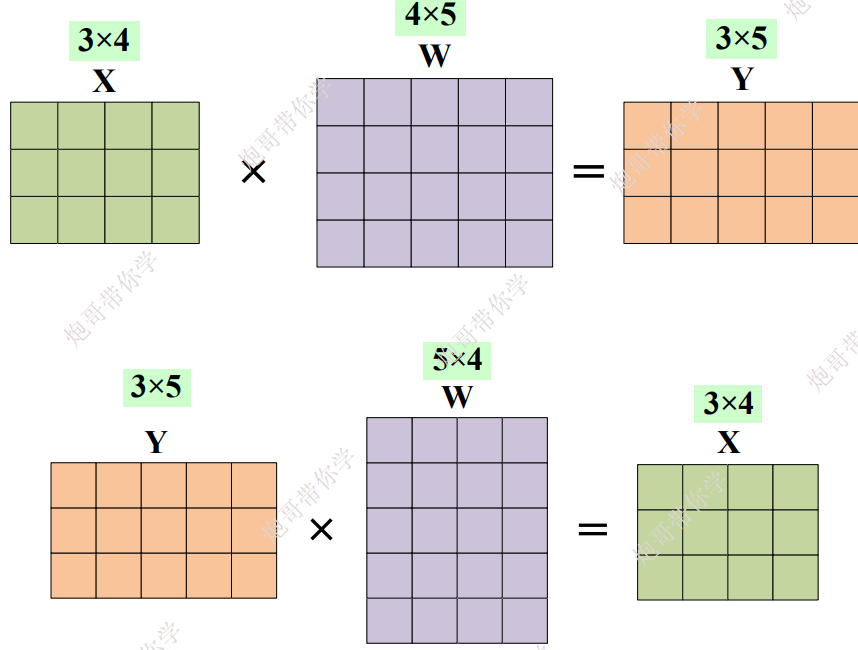

为什么Transformer的前馈神经网络输入与输出前后，要保持结果形状一致？

答：因为要进行残差计算


## 从编码器到解码器的推理

推理：获得模型后，使用模型进行正向传播，依次获得结果

编码器将句子输入解码器，之后解码器获得开始符号\<bos>，之后逐个推理出单词从 I 到 dog，最后解码器会输出一个\<eos>结束符，结束推理

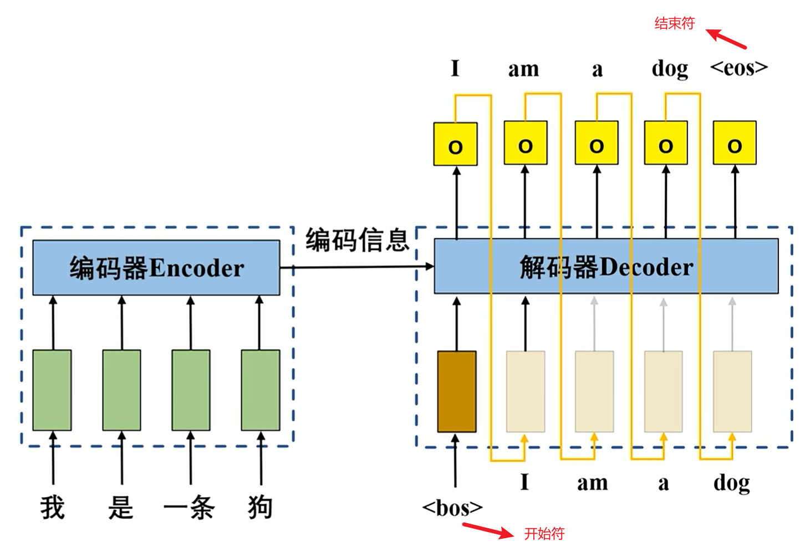

获得 "I"这个推理结果之前，其实获得的是各个单词的概率，只不过 "I"的概率比较高，所以取 "I"


## 从编码器到解码器的训练

训练：在未获得模型之前，将label标签直接放到解码器的输入端，之后并行计算，获得各个推理结果的损失值用于优化可学习参数

推理获得值之后，对应的值可以进行反向传播，优化途中的所有科学系参数

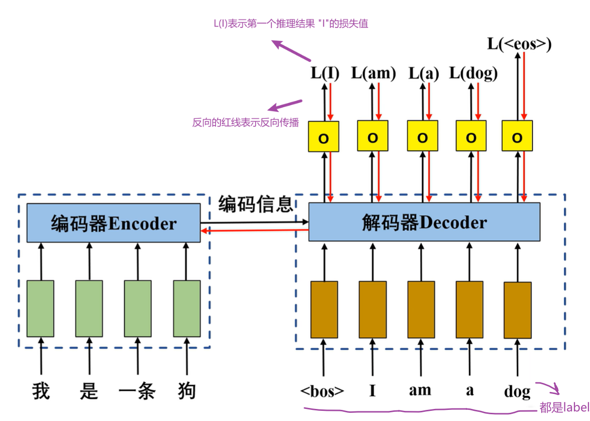


反向传播训练模型的示意图

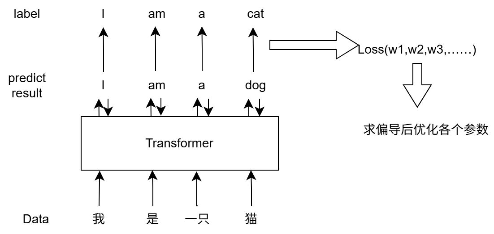


## 因果掩码注意力机制

**引入因果掩码注意力机制的原因：**

上一节《从编码器到解码器的训练》中，解码器中已经输入了正确答案，此时我们在训练过程中，模型可以提前看到正确答案，此时训练过程可能就不准确了，此时我们就需要引入因果掩码注意力机制，从而让模型在推理当前单词意思时，掩盖住其他输入的答案。

例如：我们在获得L(I)时，只会有\<bos>对模型可见，其他几个单词均会被遮掩。同理我们计算L(am)时，只有\<bos>、I对模型可见，后面的单词均会被遮盖。如下图所示：

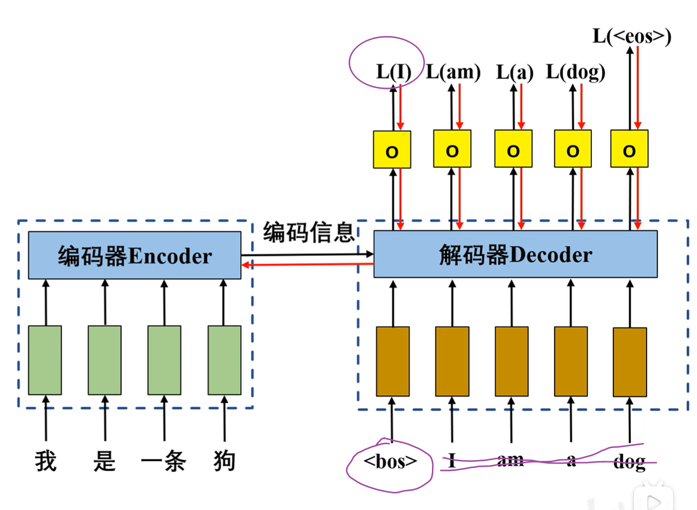

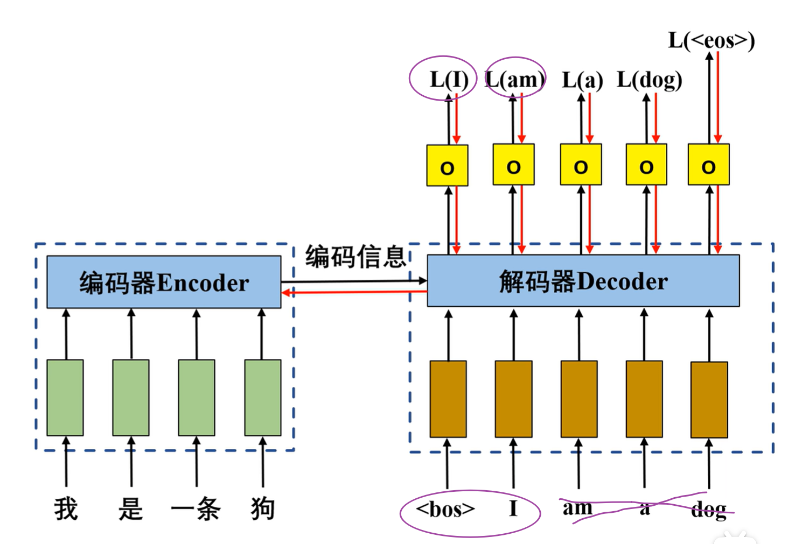

注意：L(I)、L(am)、L(a)、L(dog)四个Loss值是可以并行计算的，大大提高运行效率


# Transformer算法实战